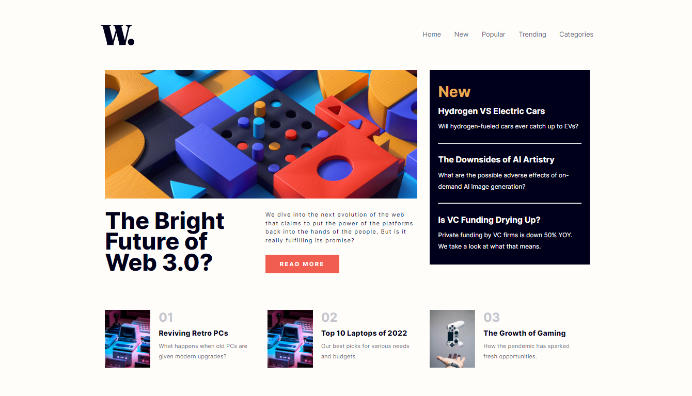

# Frontend Mentor - News homepage solution

This is a solution to the [News homepage challenge on Frontend Mentor](https://www.frontendmentor.io/challenges/news-homepage-H6SWTa1MFl). Frontend Mentor challenges help you improve your coding skills by building realistic projects. 

## Table of contents

- [Overview](#overview)
  - [The challenge](#the-challenge)
  - [Screenshot](#screenshot)
  - [Links](#links)
- [My process](#my-process)
  - [Built with](#built-with)
  - [What I learned](#what-i-learned)
- [Author](#author)

**Note: Delete this note and update the table of contents based on what sections you keep.**

## Overview

### The challenge

Users should be able to:

- View the optimal layout for the interface depending on their device's screen size
- See hover and focus states for all interactive elements on the page

### Screenshot

### Links

- Solution URL: [Click here](https://github.com/DouglasReis98/news-homepage-main)
- Live Site URL: [Click here](https://douglasreis98.github.io/news-homepage-main/)

## My process

### Built with

- Semantic HTML5 markup
- CSS custom properties
- Flexbox
- CSS Grid

### What I learned

I learnd how to use the CSS Grid to model the website layout.

## Author

- Website - [Douglas Reis](http://douglasreis.epizy.com)
- Frontend Mentor - [@DouglasReis98](https://www.frontendmentor.io/profile/DouglasReis98)
- LinkedIn - [@douglas-reis98](https://www.linkedin.com/in/douglas-reis98/)
